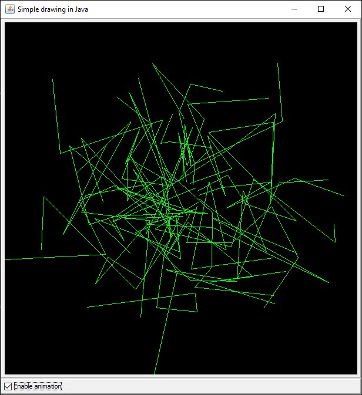

# java-drawing

Simple Java drawing example.

Notes:
1. This example requires Eclipse.
2. Tested on Eclipse Version: 2020-09 (4.17.0)

## Running the code

1. Clone this repository
2. Start Eclipse:
    1. Import project.
    2. Right-click on `simple_drawing.AppStarter.java` and select "Run As / Java application".

## Sample output

### Initial

### After a few minutes

